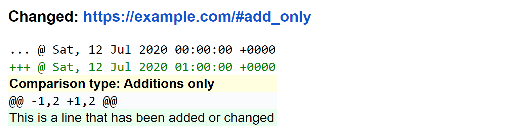
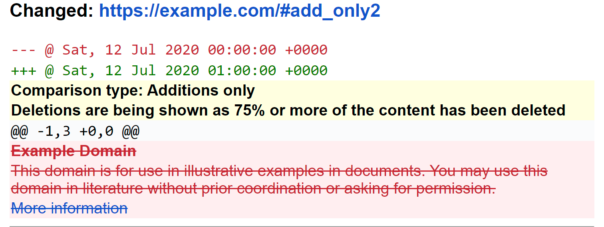
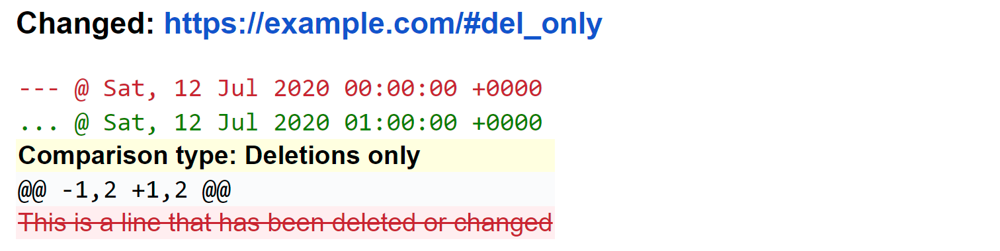

.. _diff_filters:

==================
Filtering the diff
==================
All the filters listed in :ref:`filters` can be applied to the diff before it's sent (see below how).

In addition, two filters are custom-made for diff results:

* :ref:`additions_only`
* :ref:`deletions_only`

Finally, if you're using unified diff (default), you can change the number of context lines.

* :ref:`contextlines`

.. _generic_filters:

Standard filters
----------------
See :ref:`here <filters>` for the full list of generic filters. Below is an example on how you apply a generic filter
to the result from the diff:

.. code-block:: yaml

   url: https://example.com
   diff_filter:
   - delete_lines_containing: "@@"

.. _additions_only:

additions_only
---------------
.. versionadded:: 3.0

The ``additions_only: true`` directive causes the report for that source to contain only lines that are added by the
diff (no deletions). This is extremely useful for monitoring new content on sites where content gets added while old
content "scrolls" away.

Because lines that are modified generate both a deleted and an added line by the diff, this filter always displays
modified lines.

As a safeguard, ``additions_only: true`` will display a warning (and all lines deleted) when the size of the source
shrinks by 75% or more, as this could be due to changes in where or how the information is published (requiring the job
to be reconfigured to continue monitoring the relevant information).

Changes consisting exclusively of added empty lines are not reported.

Example:

.. code-block:: yaml

   url: https://example.com/#add_only
   additions_only: true

Output:

or (text):

.. code-block::

   ---------------------------------------------------------------------------
   CHANGED: https://example.com/#add_only
   ---------------------------------------------------------------------------
   ... @   Sat, 12 Jul 2020 00:00:00 +0000
   +++ @   Sat, 12 Jul 2020 01:00:00 +0000
   /**Comparison type: Additions only**
   @@ -1,2 +1,2 @@
   +This is a line that has been added or changed

Example (when the source content shrinks by 75% or more):

.. code-block:: yaml

   url: https://example.com/#add_only2
   additions_only: true

Output:

or (text):

.. code-block::

   ---------------------------------------------------------------------------
   CHANGED: https://example.com/#add_only2
   ---------------------------------------------------------------------------
   --- @   Sat, 12 Jul 2020 00:00:00 +0000
   +++ @   Sat, 12 Jul 2020 01:00:00 +0000
   /**Comparison type: Additions only**
   /**Deletions are being shown as 75% or more of the content has been deleted**
   @@ -1,3 +0,0 @@
   -# Example Domain
   -This domain is for use in illustrative examples in documents. You may use this domain in literature without prior coordination or asking for permission.
   -[More information...](https://www.iana.org/domains/example)
   ---------------------------------------------------------------------------

Note: When using ``additions_only: true``, the key :ref:`contextlines` (the number of context lines) is set to 0; of
course, this can be changed by specifying the key with the desired value in the job.

.. versionchanged:: 3.5
   Additions consisting of only empty lines are not reported.

.. _deletions_only:

deletions_only
--------------
.. versionadded:: 3.0

The ``deletions_only: true`` directive causes the report for that source to contain only lines that are deleted by the
diff (no additions).

Changes consisting exclusively of deleted empty lines are not reported.

Example:

.. code-block:: yaml

   url: https://example.com/#del_only
   deletions_only: true

Output:

or (text):

.. code-block::

   ---------------------------------------------------------------------------
   CHANGED: https://example.com/#del_only
   ---------------------------------------------------------------------------
   --- @   Sat, 12 Jul 2020 00:00:00 +0000
   ... @   Sat, 12 Jul 2020 01:00:00 +0000
   /**Comparison type: Deletions only**
   @@ -1,2 +1,2 @@
   -This is a line that has been deleted or changed

Note: When using ``deletions_only: true``, the key :ref:`contextlines` (the number of context lines) is set to 0; of
course, this can be changed by specifying the key with the desired value in the job.

.. versionchanged:: 3.5
   Deletions consisting of only empty lines are not reported.

.. _contextlines:

contextlines
------------
.. versionadded:: 3.0

The ``contextlines`` directive causes a unified diffs to have a set number of context lines that might be different than
than Python's default of 3 (or as set by the filters above).

Example:

.. code-block:: yaml

   url: https://example.com/#lots_of_contextlines
   contextlines: 5

Output:

.. code-block::

   ---------------------------------------------------------------------------
   CHANGED: https://example.com/#lots_of_contextlines
   ---------------------------------------------------------------------------
   --- @   Sat, 01 Oct 2020 00:00:00 +0000
   ... @   Sat, 01 Oct 2020 01:00:00 +0000
   @@ -1,15 +1,15 @@
    This is line 10
    This is line 11
    This is line 12
    This is line 13
    This is line 14
   -This is line fifteen
   +This is line 15
    This is line 16
    This is line 17
    This is line 18
    This is line 19
    This is line 20

Example (default):

.. code-block:: yaml

   url: https://example.com/#default_contextlines

Output:

.. code-block::

   ---------------------------------------------------------------------------
   CHANGED: https://example.com/#default_contextlines
   ---------------------------------------------------------------------------
   --- @   Sat, 01 Oct 2020 00:00:00 +0000
   ... @   Sat, 01 Oct 2020 01:00:00 +0000
   @@ -1,15 +1,15 @@
    This is line 12
    This is line 13
    This is line 14
   -This is line fifteen
   +This is line 15
    This is line 16
    This is line 17
    This is line 18
