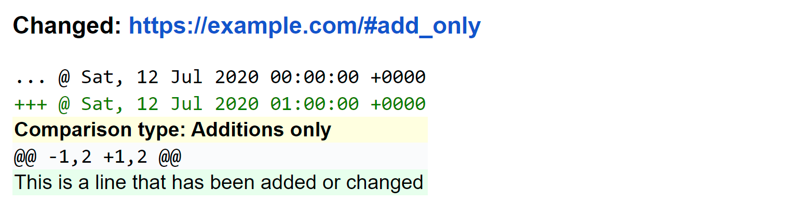
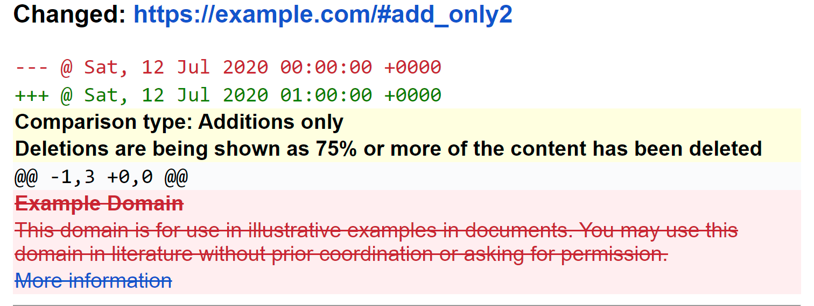
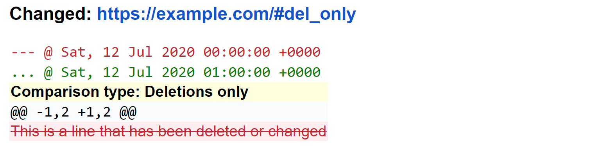

.. _diff_filters:

==================
Filtering the diff
==================

Overview
--------
All the filters listed in :ref:`filters` can be applied to the differ's output ("diff") before it's sent (see below
how). In addition to these, two filters are custom-made for the default differ :ref:`unified_diff`:

* :ref:`additions_only`
* :ref:`deletions_only`

.. _standard_filters:

Standard filters
----------------
See :ref:`here <filters>` for the full list of generic filters. Below is an example on how you apply a generic filter
to the result from the diff:

.. code-block:: yaml

   url: https://example.com
   diff_filters:
     - delete_lines_containing: "@@"

.. _additions_only:

additions_only
--------------
.. versionadded:: 3.0

The ``additions_only`` directive causes the report for that source to contain only lines that are added by the
unified diff (no deletions). This is extremely useful for monitoring new content on sites where content gets added at
the top and old content "scrolls" away.

Because lines that are modified generate both a deleted and an added line by the diff, this filter always displays
modified lines.

As a safeguard against silently missing major content removals, deletions are still shown — together with a warning
— if the new content shrinks to at or below a configurable fraction of the original size (a large drop is often a
sign that the source moved or restructured and the job needs reconfiguration). The directive accepts:

* ``true`` — enable additions-only filtering with the default safeguard threshold of ``0.25``: deletions are shown
  when 25% or less of the original content remains (i.e. 75% or more was removed). Equivalent to
  ``additions_only: 0.25``.
* a number in the range ``[0, 1]`` — the minimum fraction of the original content that must remain before the
  safeguard fires. For example, ``0.5`` shows deletions when half or less of the content remains; ``0`` only fires
  when the source has been completely wiped.
* ``"disable_safeguard"`` — keep additions-only filtering active but never show deletions, even when all content has
  been removed.
* ``false`` — disable additions-only filtering altogether.

Changes consisting exclusively of added empty lines are not reported.

Example:

.. code-block:: yaml

   url: https://example.com/#add_only
   additions_only: true

Output:

or (text):

.. code-block::

   ---------------------------------------------------------------------------
   CHANGED: https://example.com/#add_only
   ---------------------------------------------------------------------------
   ... @   Sat, 12 Jul 2020 00:00:00 +0000
   +++ @   Sat, 12 Jul 2020 01:00:00 +0000
   /**Comparison type: Additions only**
   @@ -1,2 +1,2 @@
   +This is a line that has been added or changed

Example (when the source content shrinks by 75% or more):

.. code-block:: yaml

   url: https://example.com/#add_only2
   additions_only: true

Output:

or (text):

.. code-block::

   ---------------------------------------------------------------------------
   CHANGED: https://example.com/#add_only2
   ---------------------------------------------------------------------------
   --- @   Sat, 12 Jul 2020 00:00:00 +0000
   +++ @   Sat, 12 Jul 2020 01:00:00 +0000
   /**Comparison type: Additions only**
   /**Deletions are being shown as only 25% of the original content remains**
   @@ -1,3 +0,0 @@
   -# Example Domain
   -This domain is for use in illustrative examples in documents. You may use this domain in literature without prior coordination or asking for permission.
   -[More information...](https://www.iana.org/domains/example)
   ---------------------------------------------------------------------------

Note: When using ``additions_only: true``, the differ directive :ref:`context_lines <contextlines>` (the number of
context lines) is set to 0 instead of the default 3; of course, this can be overriden by specifying the directive with
the desired value in the differ directive.

.. versionchanged:: 3.5
   Additions consisting of only empty lines are not reported.

.. versionchanged:: 3.36
   Accepts a numeric ratio and ``disable_safeguard`` in addition to ``true``.

.. _deletions_only:

deletions_only
--------------
.. versionadded:: 3.0

The ``deletions_only: true`` directive causes a unified diff to contain only lines that are deleted by the diff (no
additions).

Changes consisting exclusively of deleted empty lines are not reported.

Example:

.. code-block:: yaml

   url: https://example.com/#del_only
   deletions_only: true

Output:

or (text):

.. code-block::

   ---------------------------------------------------------------------------
   CHANGED: https://example.com/#del_only
   ---------------------------------------------------------------------------
   --- @   Sat, 12 Jul 2020 00:00:00 +0000
   ... @   Sat, 12 Jul 2020 01:00:00 +0000
   /**Comparison type: Deletions only**
   @@ -1,2 +1,2 @@
   -This is a line that has been deleted or changed

Note: When using ``deletions_only: true``, the differ directive :ref:`context_lines <contextlines>` (the number of
context lines) is set to 0 instead of the default 3; of course, this can be overriden by specifying the directive with
the desired value in the differ directive.

.. versionchanged:: 3.5
   Deletions consisting of only empty lines are not reported.
