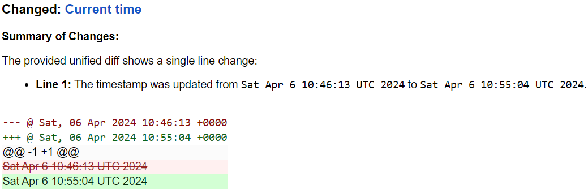

.. role:: additions
    :class: additions
.. role:: deletions
    :class: deletions

.. _differs:

==================
Differs
==================
A differ is applied to the filtered data if it has changed from the previous run(s). A differ summarizes the changes in
the data and produces the content of the report sent to you. The output of the differ can be further filtered using any
of the filters listed in :ref:`filters` (see :ref:`diff_filters` below).

.. To convert the "webchanges --features" output, use:
   webchanges --features | sed -e 's/^  \* \(.*\) - \(.*\)$/- **\1**: \2/'

At the moment, the following differs are available:

  - :ref:`unified <unified_diff>`: (default) Compares data line-by-line, showing changed lines in a "unified format";
  - :ref:`command <command_diff>`: Executes an outside command that acts as a differ (e.g. wdiff);
  - :ref:`deepdiff <deepdiff_diff>`: Compares structured data (JSON or XML) element-by-element.
  - :ref:`table <table_diff>`: A Python version of the :ref:`unified <unified_diff>` differ where the changes are
    displayed as an HTML table;

In addition, the following BETA differs are available:

  - :ref:`ai_google <ai_google_diff>`: Detects and summarizes changes using Generative AI (free API key required).
  - :ref:`image <image_diff>`: Detects changes in an image and displays them as overlay over a grayscale version of the
    old image.


A differ is specified using the job directive ``differ``. To select a differ with its default directive values,
assign the name of the differ as the value:

.. code-block:: yaml

   url: https://example.net/unified.html
   differ: unified  # this entire line can be omitted as it's the default differ

.. code-block:: yaml

   url: https://example.net/deepdiff.html
   differ: deepdiff  # use the deepdiff differ with its default values


Otherwise, the ``differ`` directive is a dictionary, and the ``name`` key contains the name of the differ:

.. code-block:: yaml

   url: https://example.net/unified_no_range.html
   differ:
     name: unified
     range_info: false


.. _unified_diff:

unified
-------
The default differ used when the ``differ`` job directive is not specified (except, for backward compatibility, when
in the configration file the ``html`` report has the deprecated ``diff`` key set to ``table``).

It does a line-by-line comparison, and reports lines that have been added (:additions:`+`), deleted (:deletions:`-`),
or changed. Changed lines are displayed twice: once marked as "deleted" (:deletions:`-`) representing the old
content, and once as "added" (:additions:`+`) representing the new content. Results are displayed in the `unified
format <https://en.wikipedia.org/wiki/Diff#Unified_format>`__ (the "*unified diff*").

For HTML reports, :program:`webchanges` colorizes the unified diff for easier legibility.

Examples:

.. code-block:: yaml

   url: https://example.net/unified.html
   differ: unified  # this can also be omitted as it's the default


.. code-block:: yaml

   url: https://example.net/unified_no_range.html
   differ:
     name: unified
     range_info: false

.. _contextlines:

The ``context_lines`` directive causes a unified diff to have a set number of context lines that might be different from
Python's default of 3 (or 0 if the job contains ``additions_only: true`` or ``deletions_only: true``).

Example:

.. code-block:: yaml

   url: https://example.com/#lots_of_contextlines
   differ:
     name: unified
     context_lines: 5

Output:

.. code-block::

   ---------------------------------------------------------------------------
   CHANGED: https://example.com/#lots_of_contextlines
   ---------------------------------------------------------------------------
   --- @   Sat, 01 Oct 2020 00:00:00 +0000
   ... @   Sat, 01 Oct 2020 01:00:00 +0000
   @@ -1,15 +1,15 @@
    This is line 10
    This is line 11
    This is line 12
    This is line 13
    This is line 14
   -This is line 15
   +This is line fifteen
    This is line 16
    This is line 17
    This is line 18
    This is line 19
    This is line 20

Example (using the default, i.e. 3):

.. code-block:: yaml

   url: https://example.com/#default_contextlines

Output:

.. code-block::

   ---------------------------------------------------------------------------
   CHANGED: https://example.com/#default_contextlines
   ---------------------------------------------------------------------------
   --- @   Sat, 01 Oct 2020 00:00:00 +0000
   ... @   Sat, 01 Oct 2020 01:00:00 +0000
   @@ -1,15 +1,15 @@
    This is line 12
    This is line 13
    This is line 14
   -This is line 15
   +This is line fifteen
    This is line 16
    This is line 17
    This is line 18


Optional directives
```````````````````
* ``context_lines`` (int): The number of lines on each side surrounding changes to include in the report (default: 3).
* ``range_info`` (true/false): Whether to include line range information lines (those starting with ``@``) (default:
  true).

.. versionchanged:: 3.21
   Became a standalone differ.
   Added the ``range_info`` directive.
   Added the ``context_line`` directive, which replaces the job directive ``contextlines``.

.. versionadded:: 3.0
   ``contextlines`` (as a job directive)

.. _ai_google_diff:

ai_google
---------
.. versionadded:: 3.21

This differ is currently in BETA and the name and/or directives MAY change in the future, mostly because of the rapid
advances in the technology and the prospect of integrating more generative AI models. Feedback welcomed `here
<https://github.com/mborsetti/webchanges/discussions>`__.

Prefaces a unified diff with a textual summary of changes generated by Google's `Gemini Pro 1.5 Generative AI model
<https://ai.google.dev/>`__ (in Preview) called via an API call. This is free of charge for most.

.. important:: Requires a system environment variable ``GOOGLE_AI_API_KEY`` containing the Google Cloud AI Studio
   API Key which you obtain `here <https://aistudio.google.com/app/apikey>`__. To access the Gemini Pro 1.5 model
   during the Preview period, make a request `here <https://aistudio.google.com/app/waitlist/97445851>`__. Note that
   starting on 2 May 2024, the use of Gemini API from a project that has billing enabled will be subject to
   `pay-as-you-go pricing <https://ai.google.dev/pricing>`__. To avoid surprises, we recommend you set up your API key
   on a project without billing or, at a minimum, set up a `budget
   <https://console.cloud.google.com/billing/01457C-2ABCC1-8A6144/budgets>`__ with threshold notification.

Gemini Pro 1.5 is the first widely available model with a context window of up to 1 million tokens, which allows it
to analyze changes in long documents (up to 350,000 words, or about 700 pages single-spaced) such as terms and
conditions, privacy policies, etc. that other models can't handle. For clarity, the model can handle up to 700,000
words, but to do a comparison we need up to a half of this for the old text and the rest for the new text.

To improve speed and reduce the number of tokens, by default we generate a separate, complete, unified diff which we
feed to the Generative AI model to summarize. See below for a custom prompt that instead feeds both the old data and
the new data to the model asking it to make the comparison.

This differ also works with less-powerful Google models, such as Gemini 1.0 Pro (see the ``model`` directive), whose
access is not gated.

.. warning:: Generative AI can "hallucinate" (make things up), so **always** double-check the AI-generated summary with
   the accompanying unified diff.

Examples
````````
The below output used the default ``prompt`` and a summary is prefaced to the unified diff.



The job directive below will uses a custom ``prompt`` to have the Generative AI make the comparison. This requires a
lot more tokens and time, but may work better in certain cases. More information about writing input prompts for
these models can be found `here <https://ai.google.dev/docs/prompt_best_practices>`__.

.. code-block:: yaml

   command: date
   differ:
     name: ai_google
     prompt: Identify and summarize the changes:\n\n<old>\n{old_data}\n</old>\n\n<new>\n{new_data}\n</new>

Mandatory environment variable
``````````````````````````````
* ``GOOGLE_AI_API_KEY``: Must contain your Google Cloud AI Studio `API Key <https://aistudio.google.com/app/apikey>`__.

Optional directives
```````````````````
This differ is currently in BETA and these directives MAY change in the future.

.. model default is retrievable from
   https://generativelanguage.googleapis.com/v1beta/models/gemini-1.5-pro-latest?key=$GOOGLE_AI_API_KEY

* ``model``: A `model name <https://ai.google.dev/models/gemini>`__ (default: ``gemini-1.5-pro-latest``).
* ``prompt``: The prompt sent to the model; the strings ``{unified_diff}``, ``{old_data}`` and ``{new_data}`` will
  be replaced by the respective content (default: ``Summarize this unified diff:\n\n{unified_diff}``).
* ``prompt_ud_context_lines`` (int): Number of context lines in the unified diff sent to the model if
  ``{unified_diff}`` is present in the ``prompt`` (default: 999). If the resulting model prompt becomes approximately
  too big for the model to handle, the unified diff will be recalculated with the default number of context lines (3).
  Note that this unified diff is a different one than the one in the report itself,.
* ``timeout`` (float): The number of seconds before timing out the API call (default: 300).
* ``temperature`` (float between 0.0 and 1.0): The model's Temperature parameter, which controls randomness; higher
  values increase diversity (see note below) (default: 0.0).
* ``top_k`` (int 1 or greater): The model's TopK parameter, i.e. sample from the k most likely next tokens at
  each step; lower k focuses on higher probability tokens (see note below) (default: model-dependent, but typically 1,
  see Google documentation; not available in ``gemini-1.5-pro-latest``)
* ``top_p`` (float between 0.0 and 1.0): The model's TopP parameter, or the cumulative probability cutoff for token
  selection; lower p means sampling from a smaller, more top-weighted nucleus and reduce diversity (see note below)
  (default: model-dependent, but typically 0.95 or 1.0, see Google documentation)
* ``token_limit`` (int): An override of the maximum size of the model's context window (used for internal testing).
* ``unified`` (dict): directives passed to :ref:`unified differ <unified_diff>` for the unified differ attached to the
  output.

Directives for the underlying :ref:`unified differ <unified_diff>` can be passed in as key called ```unified``, as
follows:

.. code-block:: yaml

   command: date
   differ:
     name: ai_google
     name: unified
       context_lines: 5
       range_info: false


.. note:: You can learn about Temperature, TopK and TopP parameters `here
   <https://ai.google.dev/docs/concepts#model-parameters>`__. In general, temperature increases creativity and
   diversity in phrasing variety, while top-p and top-k influences variety of individual words with low values leading
   to potentially repetitive summaries. The only way to get these "right" is through experimentation with actual
   data, as the results are highly dependent on it and subjective to your personal preferences.

.. tip:: You can do "dry-runs" of this (or any) differ on an existing job by editing the differ in the job file and
   running e.g. ``webchanges --test-differ 1 --test-reporter browser``. Don't forget to revert your job file if you
   don't like the new outcome!


.. _command_diff:

command
-------
Executes an outside command to use an external differ (e.g. wdiff). The external program will have to exit with a
status of 0 if no differences were found, a status of 1 if any differences were found, or any other status for any
error.

If ``wdiff`` is used, its output will be colorized when displayed on stdout (typically a screen) and for HTML reports.

For increased legibility, the differ directive ``name`` is not required (``command`` is sufficient).

Example:

.. code-block:: yaml

   url: https://example.net/command.html
   differ:
     command: wdiff

Please see warning :ref:`important_note_for_command_jobs` for the file security settings required to run jobs with
this differ in Linux.

.. versionchanged:: 3.21
   Was previously a job sub-directive by the name of ``diff_tool``.

.. _deepdiff_diff:

deepdiff
--------
.. versionadded:: 3.21

Inspects structured data (JSON or XML) on an element by element basis and reports which elements have changed, using a
customized report based on deepdiff's library `DeepDiff
<https://zepworks.com/deepdiff/current/diff.html#module-deepdiff.diff>`__ module.

Examples:

.. code-block:: yaml

   url: https://example.net/deepdiff_json.html
   differ: deepdiff  # defaults to json data


.. code-block:: yaml

   url: https://example.net/deepdiff_xml_ignore_oder.html
   differ:
     name: deepdiff
     data_type: xml
     ignore_order: true

Optional directives
```````````````````
* ``data_type`` (``json`` or ``xml``): The type of data being analyzed (default: ``json``).
* ``ignore_order`` (true/false): Whether to ignore the order in which the items have appeared (default: false).
* ``ignore_string_case`` (true/false): Whether to be case-sensitive or not when comparing strings (default: false).
* ``significant_digits`` (int): The number of digits AFTER the decimal point to be used in the comparison (default:
  no limit).

Required packages
`````````````````
To run jobs with this differ, you need to first install :ref:`additional Python packages <optional_packages>` as
follows:

.. code-block:: bash

   pip install --upgrade webchanges[deepdiff]


.. _image_diff:

image
-----
.. versionadded:: 3.21

This differ is currently in BETA, mostly because it's unclear what more needs to be changed or parametrized in order
to make the differ work with a vast variety of images. Feedback welcomed `here
<https://github.com/mborsetti/webchanges/discussions>`__.

Highlights changes in an image by overlaying them in yellow on a greyscale version of the original image. Only works
with HTML reports.

.. code-block:: yaml

   url: https://example.net/image.html
   differ:
     name: image
     data_type: url

Optional directives
```````````````````
This differ is currently in BETA and the directives may change in the future.

* ``data_type`` (``url``, ``filename``, or ``base_64``): What the data represent: a link to the image, the path to the
  file containing the image or the image itself as `Base_64 <https://en.wikipedia.org/wiki/Base64>`__ (default:
  ``url``).
* ``mse_threshold`` (float): The minimum mean squared error (MSE) between two images to consider them changed;
  requires the package ``numppy`` to be installed (default: 2.5).

Required packages
`````````````````
To run jobs with this differ, you need to first install :ref:`additional Python packages <optional_packages>` as
follows:

.. code-block:: bash

   pip install --upgrade webchanges[imagediff]

In addition, you can only run it with a default configuration of :program:webchanges:, which installsthe
``httpx`` HTTP Client library; ``requests`` is not supported.


.. _table_diff:

table
-----
Similar to :ref:`unified <unified_diff>`, it performs a line-by-line comparison and reports lines that have been added,
deleted, or changed, but the HTML table format produced by Python's `difflib.HtmlDiff
<https://docs.python.org/3/library/difflib.html#difflib.HtmlDiff>`__. Example output:

.. raw:: html

   <embed>
     <style>
        .diff { border: 2px solid; }
        .diff_add { color: green; background-color: lightgreen; }
        .diff_sub { color: red; background-color: lightred; }
        .diff_chg { color: orange; background-color: lightyellow; }
     </style>
     <!-- Created in Python 3.12 -->
     <table class="diff" id="difflib_chg_to0__top" cellspacing="0" cellpadding="0" rules="groups" >
       <colgroup></colgroup> <colgroup></colgroup> <colgroup></colgroup>
       <colgroup></colgroup> <colgroup></colgroup> <colgroup></colgroup>
       <tbody>
       <tr>
         <td class="diff_next" id="difflib_chg_to0__1"><a href="#difflib_chg_to0__0">f</a></td>
         <td class="diff_header" id="from0_1">1</td>
         <td nowrap="nowrap">This&nbsp;line&nbsp;is&nbsp;the&nbsp;same</td>
         <td class="diff_next"><a href="#difflib_chg_to0__0">f</a></td>
         <td class="diff_header" id="to0_1">1</td>
         <td nowrap="nowrap">This&nbsp;line&nbsp;is&nbsp;the&nbsp;same</td>
       </tr>
       <tr>
         <td class="diff_next"><a href="#difflib_chg_to0__1">n</a></td>
         <td class="diff_header" id="from0_2">2</td>
         <td nowrap="nowrap"><span class="diff_sub">This&nbsp;line&nbsp;is&nbsp;in&nbsp;the&nbsp;left&nbsp;file&nbsp;but&nbsp;not&nbsp;the&nbsp;right</span></td>
         <td class="diff_next"><a href="#difflib_chg_to0__1">n</a></td>
         <td class="diff_header"></td>
         <td nowrap="nowrap"></td>
       </tr>
       <tr>
         <td class="diff_next"></td>
         <td class="diff_header" id="from0_3">3</td>
         <td nowrap="nowrap">Another&nbsp;line&nbsp;that&nbsp;is&nbsp;the&nbsp;same</td>
         <td class="diff_next"></td>
         <td class="diff_header" id="to0_2">2</td>
         <td nowrap="nowrap">Another&nbsp;line&nbsp;that&nbsp;is&nbsp;the&nbsp;same</td>
       </tr>
       <tr>
         <td class="diff_next"><a href="#difflib_chg_to0__top">t</a></td>
         <td class="diff_header"></td>
         <td nowrap="nowrap"></td>
         <td class="diff_next"><a href="#difflib_chg_to0__top">t</a></td>
         <td class="diff_header" id="to0_3">3</td>
         <td nowrap="nowrap"><span class="diff_add">This&nbsp;line&nbsp;is&nbsp;in&nbsp;the&nbsp;right&nbsp;file&nbsp;but&nbsp;not&nbsp;the&nbsp;left</span></td>
       </tr>
       </tbody>
    </table>
   </embed>

For backwards compatibility, this is the default differ for an ``html`` reporter with the configuration setting
``diff`` (deprecated) set to ``html``.


.. code-block:: yaml

   url: https://example.net/table.html
   differ: table

Optional directives
```````````````````
* ``tabsize``: Tab stop spacing (default: 8).

.. versionchanged:: 3.21
   Became a standalone differ (previously only accessible through configuration file settings).
   Added the ``tabsize`` directive.
